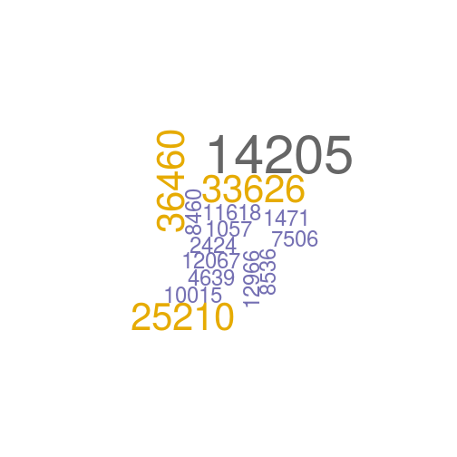
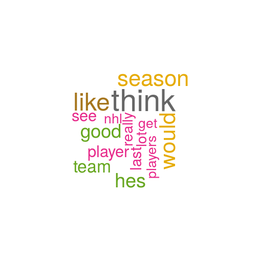

## Exploring IAmA Subreddit 

 

- The IAmA subreddit is one of the most popular subreddits, where users can submit prompts for others to ask questions about any topic. Many celeberties and politicians have participated in the past.  

- The first step to learning more about this online community is to explore which users respond to which submissions and investigate the common word usage of these users.

- Check out the [IAmA-App](https://norbertbin.shinyapps.io/IAmA-App/).

---

## IAmA Subreddit Data

1. Data was pulled from the top 995 hot submissions to the IAmA subreddit as ranked by reddit on 02/20/2015. A maximum of 1000 comments were pulled from each submission. 
2. The text in the comments and the submissions was processed to remove stop words and punctuation. 
3. User names and submission ids were anonymized to protect privacy. 
4. The data contains a total of  39,130 unique users.

---

## IAmA-App

1. A word, user, or submission can be explored by selecting one of the three radio buttons. 
2. The desired word, user id, or submission id should then be entered in the text box. 
3. Pressing the update button will draw a cloud representing word frequency or user word usage frequency. 
4. The tabs above the graph can be used to switch between a word cloud representation and a bar graph.

---

## Example for "statistics"

If we look up "statistics" we get the word cloud of user ids shown below.

 

---

## Example for "statistcs" Continued

If we then look up the highest frequency user "14205" we get the word cloud shown below. This indicates that the most frequent user of "statistics" seems to be commenting about sports statistics.

 
